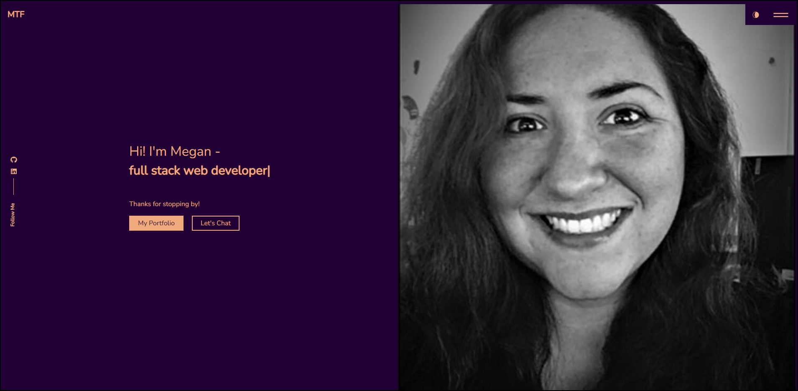

# [mtf-react-portfolio](https://mteubnerfoster.github.io/mtf-react-portfolio) 

## Description

For this project I created a React portfolio. 

## Table of Contents
* [Usage](#usage)
* [Technologies](#technologies)
* [Finished Product](#finished-product)
* [Questions](#questions)

## Usage
* Go to the [portfolio page](https://mteubnerfoster.github.io/mtf-react-portfolio) 
* Click the hamburger in the upper right corner to see the sections
* Click the moon icon in the upper right to change between dark and light modes

## Technologies
* JavaScript
* Node.js
* React
* npm
* Bootstrap
* emailjs

## Finished Product

A photo of the portfolio homepage:
 

## Questions
If you have any questions about the repo, please contact me: 
GitHub: [mteubnerfoster](https://github.com/mteubnerfoster) | Email: [mteubnerfoster@gmail.com](mailto:mteubnerfoster@gmail.com)
